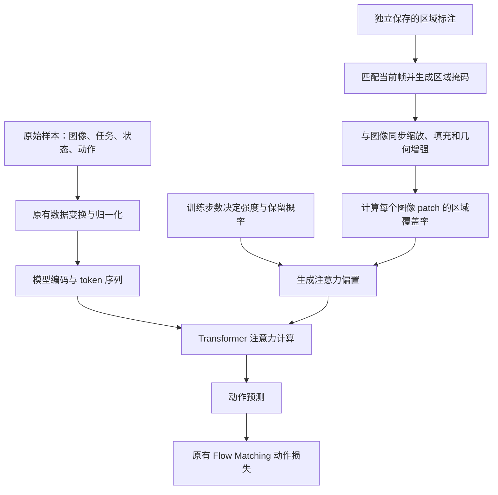

我重新核对了当前仓库里的实现。**现在这版 region-guidance 的核心，是在训练时利用已有区域标注，给模型内部“动作 token 关注目标图像区域”的注意力分数增加一个可逐渐撤掉的偏置。原来的动作损失保持不变，部署时不需要标注。**

它涉及标注读取、图像与掩码对齐、注意力计算和训练日程四部分。这里需要先说清楚：**当前没有新增一个学习“画面中是否存在任务相关文字”的预测器，也没有实现 KEM 式记忆模块。** 目前用的是已有标注来干预训练，希望这种训练最终改善模型自主利用目标区域信息的能力；这个效果还需要对照实验确认。

下面按一条训练样本经过系统的过程展开。

**标注作为训练附加信息进入系统，原来的图像、语言、状态、动作处理流程保留。**

整体关系是：



新增的数据包装器 `RegionAnnotatedDataset` 从 `annotations/all_frames.parquet` 读取标注，按下面三个字段匹配当前相机帧：

```text
episode_index + frame_index + camera
```

它会再核对全局帧索引、时间戳和原图尺寸，避免把另一帧的标注加到当前图像上。训练启动时，还会根据标注的源文件清单核验数据文件大小与 SHA256，防止数据集与标注配错。

每个样本新增两个可选字段：

```python
region_masks   # 各相机的区域掩码
region_valid   # 各相机的标注是否有效
```

对你目前这份数据，实际使用的是 **黑色标签的多边形 `label_polygon_xy`**，它会被还原成像素级掩码。没有使用几何估计的整条 `spine_roi`。

原标注中的 `use_for_region_loss` 在这里仅作为“该区域是否可用”的标志，**虽然字段名带有 loss，但实现没有增加区域损失。**

无有效标注的帧仍然参加正常动作训练，只是区域偏置为零。缺失的左腕相机也会得到零掩码和无效标志。因此，这个方法没有通过筛掉无标注样本来改变原来的训练样本集合。

**图像发生几何变化时，标注区域跟着一起变化。**

这是实现中很关键的一部分。假设原图中的标签在某个位置，图像经过缩放、填充、随机裁剪、旋转之后，区域掩码必须仍然覆盖同一个物体。

目前做了这些对齐：

| 图像处理 | 掩码对应处理 |
|---|---|
| 等比例缩放并填充 | 使用相同几何关系缩放，填充区域为零 |
| 随机裁剪 | 使用相同裁剪参数 |
| 旋转 | 使用相同旋转参数 |
| 亮度、对比度、饱和度增强 | 掩码不进行颜色增强 |

掩码使用插值，所以边界可以是 `0～1` 的小数。图像原有的增强规则保留；测试也检查了，相同随机种子下，附带掩码不会改变原来的图像增强输出。

随后，把像素掩码转换成与视觉 token 对应的区域权重。当前 SigLIP 的 patch 大小为 `14×14`：

\[
m_j=\frac{1}{14\times14}
\sum_{(x,y)\in \text{patch}_j}M(x,y)
\]

这里：

- \(M(x,y)\) 是处理后的像素掩码。
- \(m_j\) 是第 \(j\) 个 patch 被目标区域覆盖的比例。
- 完全落在目标区域内时接近 `1`，覆盖一半时约为 `0.5`，完全在区域外时为 `0`。

这样，小标签跨越多个 patch 时，每个 patch 会根据实际覆盖程度获得不同偏置。

它没有写死图像 token 数量：

| 模型输入分辨率 | 每个相机的 patch 网格 | 每个相机的图像 token 数 |
|---|---:|---:|
| 224×224 | 16×16 | 256 |
| 336×336 | 24×24 | 576 |
| 448×448 | 32×32 | 1024 |

不过，**整个当前模型仍要求输入为正方形，边长为 14 的正整数倍，而且一次训练使用固定的配置分辨率。** 所以准确说法是“区域引导随模型支持的分辨率适配”，不能理解成任意尺寸、任意长宽比都能直接送入模型。

目前仓库中普通 `pi05_piper_lora_finetune` 配置是 **448×448**，`pi05_piper_full_finetune` 是 **224×224**；region-guidance 开关本身不改变它们。

**注意力修改发生在模型内部，具体位置是 softmax 之前的分数。**

原来的注意力可以写为：

\[
S_{ij}=\frac{q_i^\top k_j}{\sqrt d}
\]

\[
A_{ij}=\operatorname{softmax}_j(S_{ij}+C_{ij})
\]

其中 \(C\) 表示原有的注意力可见性约束。

现在，在选定的层和注意力头里，对“动作 query → 图像 key”增加：

\[
B_{b,j}=\lambda(t)\cdot z_{b,c(j)}
\cdot v_{b,c(j)}\cdot m_{b,j}
\]

\[
A'_{b,ij}
=
\operatorname{softmax}_j
\left(S_{b,ij}+B_{b,j}+C_{b,ij}\right)
\]

各项的含义是：

| 符号 | 当前实现中的含义 |
|---|---|
| \(\lambda(t)\) | 当前训练步的偏置强度 |
| \(z_{b,c}\) | 当前样本、当前相机是否启用引导的随机开关 |
| \(v_{b,c}\) | 相机及其区域标注是否有效 |
| \(m_{b,j}\) | 对应图像 patch 的区域覆盖率 |

举个具体例子：训练前期强度为 `0.5`，当前相机的引导开关打开，标注有效。

```text
目标覆盖整个 patch：注意力分数 +0.5
目标覆盖一半 patch：注意力分数 +0.25
背景 patch：         注意力分数 +0
```

这里加的是 **softmax 前的分数**，不是直接给最终注意力概率加 `0.5`。

在原始分数相同的条件下，对一个目标 patch 加 `0.5`，会使它相对于一个未加偏置的背景 patch 的注意力权重比乘以：

\[
e^{0.5}\approx1.65
\]

因此，目标区域更有机会被动作计算使用，背景仍然可以被关注。原来的硬注意力遮罩也继续生效，区域偏置不能让模型访问原本被禁止访问的 token。

**这次只对一小部分注意力连接施加偏置。**

当前 pi0.5 默认设置为：

| 范围 | 默认设置 |
|---|---|
| Transformer 层 | 索引 `8、9`，按 0 开始计数，即第 9、10 层 |
| Query 注意力头 | 索引 `0、1` |
| Query token | 动作 token |
| Key token | 图像 token |
| 区域权重 | 标注区域的 patch 覆盖率 |

当前动作长度为 30 时，作用对象就是序列最后的 30 个动作 token。

这发生在已有的 Transformer 注意力计算中，没有额外增加一层 cross-attention。SigLIP 内部的视觉自注意力也没有改动。

选择部分中间层、部分头，是为了给目标区域增加一条受引导的信息路径，同时保留其他注意力头处理环境、机械臂、障碍物和放置位置的能力。**这组层和头只是实验起点，还没有证明是最优选择。**

此外，同一相机的区域偏置会共享给被选中的动作 query。当前没有根据“正在识别、正在抓取、正在放置”分别决定是否引导，也没有学习不同动作时刻该关注多少。

**为了降低模型对训练标注的依赖，引导会随机关闭，并在训练后期完全撤掉。**

首先是随机关闭：默认保留概率为 `0.5`，按“样本 × 相机”独立采样。

也就是说，一个有效相机画面有一半概率获得区域引导。它不是每个 patch 独立随机开关；同一相机的所有 patch、选中层和选中头共享这次开关。

这个开关是**随机正则化机制**，不是模型判断“当前画面文字是否重要”的结果。

其次是按训练进度退火。默认日程为：

| 总训练进度 | 偏置强度 | 引导保留概率 |
|---|---:|---:|
| 前 30% | 0.5 | 0.5 |
| 30%～70% | 从 0.5 线性降到 0 | 从 0.5 线性降到 0 |
| 最后 30% | 0 | 0 |

例如训练 10,000 步：

```text
step 0～3000：strength=0.5，keep_probability=0.5
step 5000：  strength=0.25，keep_probability=0.25
step ≥7000： strength=0，keep_probability=0
```

强度和概率同时下降，所以平均引导量会比单独线性下降强度衰减得更快。

这里的进度根据 **优化器训练步数** 计算，与一个 episode 进行到哪个动作阶段没有关系。断点恢复后也会从保存的训练步数继续计算，不会重新从最大强度开始。

**损失函数没变，但前向计算变了，因此参数更新也会受到影响。**

当前仍使用原来的 Flow Matching 动作损失，代码最后仍然是：

```python
return jnp.mean(jnp.square(v_t - u_t), axis=-1)
```

没有增加：

```text
区域分割损失
框回归损失
注意力对齐损失
文字识别损失
```

作用过程是：

```text
目标区域的注意力分数提高
        ↓
动作 token 聚合到的视觉信息发生变化
        ↓
动作预测发生变化
        ↓
原来的动作损失产生相应梯度
        ↓
更新原有可训练参数
```

如果运行 LoRA 微调，仍然遵守原配置的可训练参数范围。region-guidance 本身没有新增可训练权重。

因此，它可以被理解为一种**用区域标注辅助训练的注意力干预**。随机关闭与末期撤掉引导，让模型在训练中也有机会适应没有标注偏置的情况。不过，这并不能保证模型一定会把这种偏好保留下来，最终仍要通过无标注推理验证。

**原方法的启动、部署和 checkpoint 兼容性也做了对应处理。**

模型配置默认：

```python
region_guidance = None
```

只有在启动命令中显式添加：

```bash
--region-guidance
```

才会启用。标注目录默认是：

```text
<dataset-dir>/annotations
```

可以用 `--region-annotations-dir` 单独指定。其他主要参数为：

```bash
--region-bias-strength 0.5
--region-keep-probability 0.5
--region-decay-start 0.3
--region-decay-end 0.7
--region-layers 8 9
--region-heads 0 1
```

部署时，`sample_actions()` 不注入区域偏置，也不需要标注文件。`compute_loss(train=False)` 同样评估无引导的模型。

因为没有新增参数，训练后的权重可以用匹配分辨率和 LoRA 结构的原模型配置加载。为了避免续训时意外改变方法，输出目录会保存 `region_guidance.json`，恢复时核对引导参数、总训练步数、分辨率和数据路径。

训练日志新增：

```text
region/strength
region/keep_probability
region/valid_fraction/<camera>
```

最后一项记录的是标注有效比例，**不代表实际打开随机开关的比例，也不代表模型真正分配给该区域的注意力大小**。当前还没有加入注意力热图统计或区域注意力占比指标。

训练会多出标注读取、掩码处理和偏置计算的开销。即使后期偏置已经归零，当前数据加载器仍然读取并处理掩码，所以不能把这一阶段说成完全没有额外训练开销。

具体代码落点如下，便于你查看：

| 文件 | 改动内容 |
|---|---|
| [region_annotations.py](/home/ubun/project/stu_vla/openpi-stu/src/openpi/training/region_annotations.py:57) | 标注匹配、有效性检查、多边形还原与掩码附加 |
| [data_loader.py](/home/ubun/project/stu_vla/openpi-stu/src/openpi/training/data_loader.py:182) | 按配置选择原数据包装器或区域标注包装器 |
| [model.py](/home/ubun/project/stu_vla/openpi-stu/src/openpi/models/model.py:153) | 图像与区域掩码同步预处理和几何增强 |
| [region_guidance.py](/home/ubun/project/stu_vla/openpi-stu/src/openpi/models/region_guidance.py:11) | 参数配置、退火、patch 覆盖率、随机开关与偏置计算 |
| [pi0.py](/home/ubun/project/stu_vla/openpi-stu/src/openpi/models/pi0.py:194) | 在训练前向中构造动作 query、图像 key 的引导范围 |
| [gemma.py](/home/ubun/project/stu_vla/openpi-stu/src/openpi/models/gemma.py:165) | 在 softmax 前注入注意力偏置，并逐层传递控制信息 |
| [train_piper.py](/home/ubun/project/stu_vla/openpi-stu/scripts/train_piper.py:52) | 命令行开关与配置构建 |
| [train.py](/home/ubun/project/stu_vla/openpi-stu/scripts/train.py:138) | 按训练步计算日程、记录日志、检查恢复配置 |

**目前验证的是实现可用和兼容性，任务效果还没有得到验证。**

已有的[验证报告](/tmp/openpi_region_guidance_smoke/report.json)记录了 71 项相关测试通过，覆盖偏置作用范围、硬遮罩保持、掩码对齐、原数据张量一致性、梯度、checkpoint 恢复和无标注推理等；真实数据、真实基础权重的 GPU 短程检查也已通过。原数据文件的内容及修改时间保持不变。

这里也纠正一下我前面关于分辨率测试范围的表述：**真实数据的 region-guidance GPU 检查做的是 448×448；新增小模型测试主要使用 28×28。不能说 224、336、448 都分别完成了完整的引导训练端到端验证。** 代码按 patch 网格适配这些合法分辨率，但支持范围与实测范围需要区分。

当前实现支持的是 **JAX + 标准 Piper LeRobot 数据流程**。PyTorch、RLDS，以及额外自定义几何预处理的流程还没有接入。

对你这份数据，下一步最有价值的证据是：保持数据划分、初始权重、训练步数和 batch size 一致，比较开关 region-guidance 后，**无标注部署时的选对书成功率、抓取成功率和完整取放成功率**。由于目前引导区域是黑色标签，这个实验首先验证“目标区域引导是否有助于操作”；要进一步证明通用场景文字理解，还需要使用文字区域和文字相关任务进行验证。

完整使用说明已放在 [region_guidance.md](/home/ubun/project/stu_vla/openpi-stu/docs_piper/region_guidance.md)。